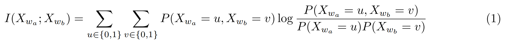
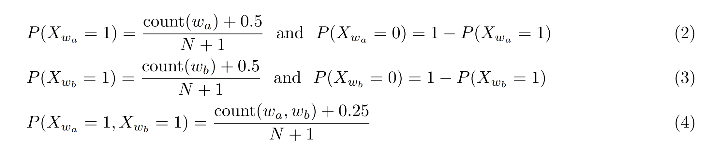
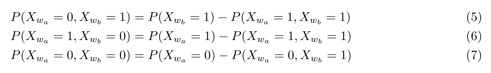
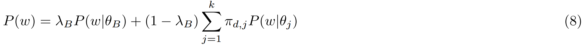
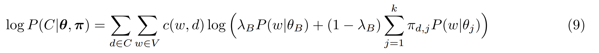
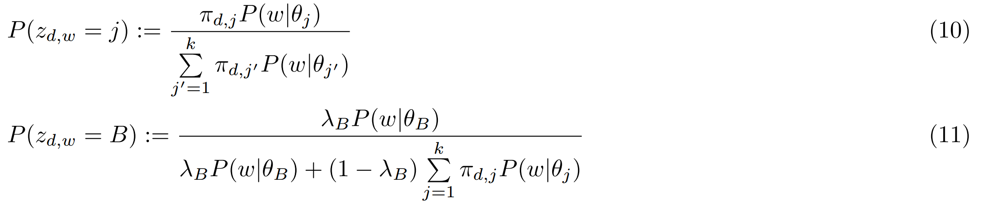
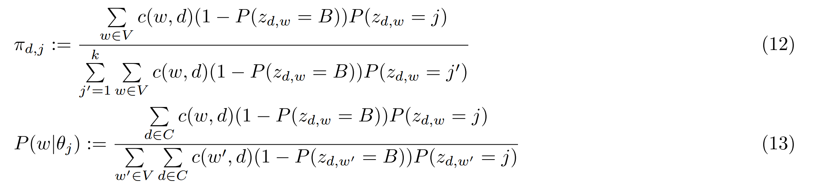

```{r setup, echo = FALSE, include = FALSE}
library('plyr')

pkgs <- c('dplyr', 'magrittr', 'stringr', 'purrr', 'tidyr', 'formattable')

suppressMessages(l_ply(pkgs, require, character.only = TRUE))
rm(pkgs)
```

# 1. Introduction

  - Section [1.1 Assignment]
    + Section [1.1.1 Assignment Overview]
    + Section [1.1.2 Downloading the Assignment]
  - Section [1.2 MeTA Overview]
  - Section [1.3 Inverted and Forward Indices]
  - Section [1.4 Configuring MeTA]
    + Section [1.4.1 Task 1 (Warm Up): Part-of-Speech Tagging (10%)]
    + Section [1.4.2 Task 2: Word Association Mining (30%)]
    + Section []
  - Section [1.7 Preparing Environment]

## 1.1 Assignment

**Honors Programming Assignment: Programming Assignment**

*You have not submitted. You must earn 70/100 points to pass.*

### 1.1.1 Assignment Overview

  In this assignment, you are going to have hands-on experience with several important text mining techniques that you have seen in the lectures. The assignment is composed of the following four tasks:

  - Task 1 (Part of Speech Tagging) where you will apply POS tagging on a document
  - Task 2 (Word Association Mining) in which you will implement mutual information and extract the top syntagmatically related words from the corpus
  - Task 3 (Topic Modeling) where you will code a part of PLSA and experiment with its parameters
  - Task 4 (Text Mining Classification) where you are going to use Yelp restaurant reviews to predict whether each restaurant is clean or not as judged by health inspectors

  Working on these tasks will allow you to more accurately understand some important concepts, such as mutual information, and algorithms, such as the EM algorithm. To enable you to get the maximum benefit of learning from this programming assignment while minimizing your effort, we have provided a partial implementation of all the algorithms so that you only need to spend minimum effort on coding once you have completely understood the relevant concepts and algorithms. We hope this also make it more feasible for those of you who are not very familiar with coding in C++ to work on the programming assignment, thus allowing as many people to benefit from the programming assignment as possible.

### 1.1.2 Downloading the Assignment

  In what follows, we assume that you have already installed MeTA and the directory **meta** is located in `~/Desktop/`. If you haven't installed MeTA yet, follow the installation instructions on this [page](https://meta-toolkit.org/setup-guide.html#windows-build-guide). If you choose to install MeTA in a different location, you should change ~/Desktop/ to the parent directory of the directory **meta**. If you are using the provided virtual image, you do not have to make any changes.

  1. Download Assignment.tar.gz and extract it into the parent directory of **meta**. If **meta** is in `~/Desktop/`, then you should extract the assignment in `~/Desktop/`.

  2. Change the directory to Assignment and run the bash script Setup.sh. This can be done using the following two commands

```
cd Assignment/ 
./setup.sh 
```

**Setup.sh** will copy the assignment files and the datasets to MeTA.

Recompile MeTA:

```
cd Assignment/build
cmake .. -DCMAKE_BUILD_TYPE=Release; make -j8
```

[`Assignment.tar.gz`](https://d3c33hcgiwev3.cloudfront.net/_b301e10034c5c336bbd66a1fd20528e7_Assignment.tar.gz?Expires=1468972800&Signature=dRHLduVw1OoyFsnu8fBFIaf7M8uTCSYcEwPSRgGTqTAM2BzlYP~ewKk67lBlyBrE9cKZsVlbokLJ8kksZOG6kyfEcFrGhbotfpqrgbeY6L5el-iHslb9HbfrejZz-~xrhIt0OF3PayZ~QG9ObXfhH9tCJ9sCStoEq1xQKtp-Nog_&Key-Pair-Id=APKAJLTNE6QMUY6HBC5A)


## 1.2 MeTA Overview

  Before starting with the assignment, you are highly encouraged to read [MeTA's System Overview](https://meta-toolkit.org/overview-tutorial.html) to gain a high-level understanding of how MeTA operates. Throughout the assignment, if you want to know more about a certain class or function, you can use the search toolbar in [MeTA's Documentation](https://meta-toolkit.org/doxygen/index.html), which provides a brief explanation of the different modules. Below we will quickly go over some concepts that will help you understand how MeTA works.

## 1.3 Inverted and Forward Indices

  Two important data structures frequently used in text mining and retrieval applications are the **inverted index** and the **forward index**. The inverted index is a mapping that stores terms as keys and document IDs as values, thus allowing efficient lookup of all the documents that contain a specific term. The forward index, on the contrary, has document IDs as keys and words as values, which allows us to efficiently extract the terms in a specific document. MeTA stores all datasets in the form of an inverted index or a forward index, depending on the requirements of the application. In the assignment's code, we will use both indices to process the datasets. You can find out more information on these indices in this [Wikipedia article](http://en.wikipedia.org/wiki/Search_engine_indexing). See [Disk_Index Class Reference](https://meta-toolkit.org/doxygen/classmeta_1_1index_1_1disk__index.html) for the API of the indices in MeTA (you can click on the inverted or forward index in the inheritance diagram to access their specific APIs).

## 1.4 Configuring MeTA

  Most of the parameters in MeTA can be changed using a single file called **config.toml** located in `meta/build/`. Open the file and have a look at its content. For example, the following snippet:

```
corpus = "line.toml"
dataset = "yelp"
forward-index = "yelp-fwd"
inverted-index = "yelp-inv"
```

  tells MeTA that we are going to use a dataset called “yelp” and the corpus configuration file is called "line.toml". You should also check the file `Assignment/datasets/yelp/line.toml`

```
type = "line-corpus"
```

  which shows the corpus type is set to "line corpus", meaning that it is stored in one file where each document occupies a single line. "yelp-fwd" and "yelp-inv" are the names of forward and inverted indices to be created. We are going to use the Yelp dataset for word association mining later on. For more information, check out the [MeTA System Overview page](https://meta-toolkit.org/overview-tutorial.html) and look for the section "Corpus input formats".

  Another important snippet is:

```
[[analyzers]]
method = "ngram-word"
ngram = 1
[[analyzers.filter]]
type = "whitespace-tokenizer"
[[analyzers.filter]]type = "lowercase"
[[analyzers.filter]]
type = "alpha"
[[analyzers.filter]]
type = "length"
min = 2
max = 35
[[analyzers.filter]]
type = "list"
file = "../../meta/data/lemur-stopwords.txt"
[[analyzers.filter]]
type = "porter2-filter"
```

  This tells MeTA how to process the text before indexing the documents. "ngram=1" configures MeTA to use unigrams (single words). Each "[[analyzers.filter]]" tag defines a text filter that applies a special function on the text. These filters are being "chained" together; text will first be processed by a whitespace tokenizer, which separates words based on white spaces, then all the tokenized words will be converted to lowercase. This is followed by a couple of filters that end up with [stopword removal](http://en.wikipedia.org/wiki/Stop_words) and [stemming](http://en.wikipedia.org/wiki/Stemming). These filters can be usually changed depending on the application. For more information on how to use and configure the filters in MeTA see [MeTA's Analyzers, Tokenizers, and Filters documentation](https://meta-toolkit.org/analyzers-filters-tutorial.html).

  Note: Do not change any settings in **config.toml** when doing Tasks 1, 2, and 3 unless told to do so. In Task 4 (Classification), you are free to explore and change any parameters you want.

### 1.4.1 Task 1 (Warm Up): Part-of-Speech Tagging (10%)

  MeTA supports several shallow text analysis techniques, such as stemming and frequency analysis, in addition to natural language processing techniques, like part-of-speech tagging and parsing, that allow a deeper understanding of text. These methods can be applied to individual text documents as well as to the entire corpus without doing any coding.

  Part-of-speech (POS) tagging refers to the process of assigning part-of-speech tags, such as “noun” or “verb,” to words in documents. MeTA has a built-in part-of-speech tagger that has been already trained on an English corpus.

  In this task, you are going to run POS tagging on a text document. Go to `Assignment/build/Assignment/` and have a look at the content of **doc.txt**. This document contains the description found on the syllabus of this course. To perform POS tagging on **doc.txt**, execute:

```
cd Assignment/build
cmake .. -DCMAKE_BUILD_TYPE=Release; make -j8
./analyze ../config.toml Assignment/doc.txt --pos
```

  The second command runs a built-in program in MeTA called **analyze** and passes to it the configuration file **config.toml** and **doc.txt** as arguments. It is very common to pass **config.toml** as an argument to applications in MeTA.

  Now in `Assignment/build/Assignment/` you should find a new file called **doc.pos-tagged.txt** which was output by **analyze**. Open this file and examine its content. You should see how the POS tags are attached to each word after the underscore. Note that the tags are abbreviated. For example, the first word “this” has been assigned the tag “DT” which refers to a determiner, whereas the second word got “NN” which refers to a noun. For a description of the commonly used POS tags see Penn Treebank list of POS tags.

  Then, we ask you to do following and submit doc.pos-tagged.txt.wc

```
cd Assignment
wc  <  doc.pos-tagged.txt  | sed 's/^\s*//g' >  doc.pos-tagged.txt.wc
```

### 1.4.2 Task 2: Word Association Mining (30%)

  In this task, you will mine the words with the strongest syntagmatic relations in a corpus of 10,000 restaurant reviews extracted from the Yelp Academic Dataset. The corpus is located in `datasets/yelp`. If you want to have a quick look at the dataset, go to its directory and open **yelp.dat**, which contains each review on a separate line. We have already configured MeTA to use the Yelp dataset through **config.toml**, as discussed previously.

  Words with strong syntagmatic relations usually tend to co-occur frequently together while having relatively low individual occurrence. There are many applications where syntagmatic relation mining is important. For example, in retrieval, words that have strong syntagmatic relations with the original query words can be used to expand the query in order to enhance retrieval results. Another application is opinion summarization; for example, we can extract the top K syntagmatically related words to "iPhone 6" from a corpus of customer reviews in order to summarize the users' feedback.

  The techniques used to mine word associations can be generally classified into two categories. The first is hypothesis testing, where statistical tests are used to determine if the co-occurrence of two words happened by chance or due to an actual correlation. The second category is information-theoretic and is based on measures such as mutual information, which was discussed in the lectures. For a survey of the different methods used for word collocation mining see this chapter on [collocation mining](http://nlp.stanford.edu/fsnlp/promo/colloc.pdf).

  We are going to focus on implementing Mutual Information as the association measure to mine the top K syntagmatically related words in the Yelp corpus. Let $X_{wa}$ and $X_{wb}$ be two binary random variables that denote whether the words wa and wb have appeared in a certain document. The mutual information, $I(X_{wa};X_{wb})$, measures the dependence between the two random variables associated with the two words. More specifically, it measures the reduction in the entropy (randomness) of one of the words when we have knowledge about whether the second word is present in the document or not. The mutual information between the two random variables is defined as follows:



  The probabilities in (1) can be estimated based on the frequency of the words in the corpus while using additive smoothing to avoid zero probability assignments. The main probability estimates can be written as:



  where $count(w)$ is the number of documents the word w appears in (i.e., the document frequency of w) and $count(w_{a},w_{b})$ is the number of documents where both wa and wb occur. By applying the law of total probabilities, we can write the rest of the probability estimates as follows:



  We have created a special program for this task called **association.cpp** located in `meta/src/tools/`. Before proceeding to implement mutual information, we will first use **association** to print the top 50 words with the highest co-occurrence in the corpus, i.e., association will rank each two words $w_{a}$ and $w_{b}$ based on $count(w_{a},w_{b})$ and will then print the top 50 word pairs. To run **association**, in the terminal execute:

```
cd Assignment/build
./association ../config.toml --words 50
```

  You should see the top 50 word pairs printed along with their numbers of occurrence (the program might take some time to produce the output). As you have noticed, many of the top terms are very common and not interesting. This can be explained by the fact that a high number of co-occurrences alone does not imply high correlation; for words to be highly correlated, they must co-occur frequently and have relatively low individual occurrences.

  To get more informative word pairs, we will use mutual information as the association measure. Open **association.cpp**. **association.cpp** contains an incomplete implementation of mutual information. Your task is to complete the code of the function **MutualInformation**, which is located at the top of the file. Equations (2), (3), and (4) have already been implemented. Specifically, you should enter the correct formulas for equations (5), (6), and (7) and implement the mutual information formula, i.e., equation (1), in the return statement. Make sure to read and strictly follow the comments in the code and to use log base 2 for implementing the logarithm (you can write $log2x$ as $log2(x)$ in C++). Also, do not forget to save the file after you finish coding.

  After you finish coding the mutual information function, you should recompile MeTA by executing

```
cd Assignment/build
cmake .. -DCMAKE_BUILD_TYPE=Release; make -j8
```

  If the compilation process terminates with an error, make sure that your syntax is correct. Before proceeding with the exercise, submit your code and make sure that you have received full credit. You can do so by executing:

```
cd Assignment/build
./association ../config.toml --submission
```

  And as usual, to submit your result, run the following:

```
cd Assignment
wc < mutual-information.txt | sed 's/^\s*//g' > mutual-information
    .txt.wc
```

  And submit the file mutual-information.txt.wc (Note that "./association config.toml --submission" might take up to a minute to finish executing.)

  Now you will run **association** to print the top 50 syntagmatically related terms based on the mutual information function you coded. You can do this by executing:

```
./association ../config.toml --words 50 --MI
```

  where the argument “--MI” specifies that we want to use mutual information as the association measure. The top 50 word pairs will be printed along with their mutual information values. As you can see, the words are highly correlated and provide a good summary of the Yelp reviews. Note: some of the words might seem to be misspelled; this is due to stemming, which strips off some of the characters from words.

### 1.4.3 Task 3: Topic Modeling (30%)

  In the section, you will learn how to implement and experiment with Probabilistic Latent Semantic Analysis (PLSA), which is the most basic topic model, and also one of the most useful ones for mining topics and themes from text collections. PLSA assumes that each document in the corpus is generated from a set of topics represented by a unigram language model. Every document is also associated with a set of mixing weights that determine the proportions of topics in the document. In addition to the topic models, a fixed background language model can be also used to explain the generation of very frequent words.

  Let $θ_{1},...,θ_{k}$ be unigram language models representing each of the $k$ topics and $θ_{B}$ be the background language model which is estimated based on the frequency of the words in the corpus. Then, the probability of generating a word $w$ in a document $d$ is given by:



  where $λ_{B}$ is a fixed proportion that determines the extent to which the background language model explains the generation of words. $π_{d,j}$ is the mixing weight of the j-th topic that determines the proportion of topic j in document d.

  Our goal is to find the distributions of the topics and the mixing weights of documents that maximize the likelihood of observing all the documents in the corpus. The log-likelihood of the documents is given by:



  where $c(w,d)$ is the frequency of w in d. (9) is hard to maximize due to the presence of the log inside the summations. One way to maximize (9) is to use the EM algorithm, which is an iterative algorithm usually used to solve intractable maximum likelihood problems. In the E-step it tries to “guess” the probability that each word w was generated using the topic j by using latent variables. In the M step, it optimizes the parameters (i.e., the topic distributions and mixing weights) assuming that the guessed probabilities in the E-step are correct.

  The update formulas for the E-step are given by:



  where $z_{d,w}$ is the latent variable associated with word w in document d.

  The update formulas for the M-step are given by:



  After completing each M-step, the EM algorithm is guaranteed to increase the likelihood of the data until it converges to a local maximum. Practically, we usually run the algorithm several times using randomly selected parameters and choose the parameter values that yield the highest likelihood.

  The EM algorithm is a very important general algorithm with many applications, thus it is essential that you understand exactly how it works for **PLSA**. However, asking you to implement the whole EM algorithm would require too much coding effort. As a compromise, we thus have created a special program for this task called plsa to minimize your effort while retaining the benefit of learning about the EM algorithm.

  Open the file **plsa.cpp**. This file contains a naïve implementation of the PLSA algorithm that uses equations (10), (11), (12), and (13) as they are. The algorithm is almost complete with the exception of equation (11) in the E-step, which you are expected to complete.

  Start from the top of the file by reading the comments inside the PLSA class to familiarize yourself with the different variables involved. Then, proceed to reading the comments inside the functions **PLSA::Estep()** and **PLSA::Mstep()** and try to understand how equations (10), (12), and (13) are implemented. Equation (11) has not been fully implemented and a part of its code is missing. Your task is to complete the implementation of equation (11) in the E-step.

  The table below shows a mapping between some of the important variables that you are going to use in implementing the code and the variables used in equation (11):

```{r tp-model, echo = FALSE, results = 'asis'}
tpmodel <- data_frame(`Variable Name in plsa.cpp` = c('pi[d][j]', 'Pw[j][w]', 'PzB[d][w]', 'lambda_B', 'num_topics', 'PB[w]'),	`Variable Name in Eq (10) to (13)` = c('πd,j', 'P(w|θj)', 'P(zd,w=B)', 'λB', 'k', 'P(w|θB)'))

tpmodel %>% formattable %>% as.htmlwidget
```

  Make sure to strictly follow the comments in the code when implementing equation (11).

  We are going to run PLSA on a dummy dataset containing reviews of four types of products: cars, boats, laptops, and wearables. Go to `datasets/reviews` and have a look at some of the documents. You should configure MeTA to use this dataset when running PLSA. To do so, open **config.toml** replace:

```
corpus = "line.toml"
dataset = "yelp"
forward-index = "yelp-fwd"
inverted-index = "yelp-inv"
```

  with

```
corpus = "line.toml"
dataset = "reviews"forward-index = "reviews-fwd"inverted-index = 
    "reviews-inv"
```

  Save the changes to the file. After coding equation (11), you should recompile MeTA like before.

  After compiling, run the plsa:

```
./plsa ../config.toml --submission
```

  And generate submission file:

```
cd Assignment
wc < plsa.txt | sed 's/^\s*//g' > plsa.txt.wc
```

  Submit **plsa.txt.wc** file

  Now you should run PLSA with the number of topics set to 2, the number of iterations to 300, and $λ_{B}$ to 0.8 by executing:

```
./plsa ../config.toml --topics 2 --lambda 0.8 --iter 300 --seed 11 
```

  where the "--seed 11" is used to randomly initialize the parameters of PLSA. While the algorithm is running, it will print out the values of the log-likelihood. You should observe how the log-likelihood always increases in the beginning before it reaches a value where it becomes constant; this means that the algorithm has converged.

  After the algorithm converges, the top 20 terms in each topic will be printed. You should be able to see that the first topic summarizes the reviews on laptops and wearables and that the second topic summarizes the reviews on boats and cars. This is expected since laptops and wearables are more related to each other and can fit into the category of "technology" and, similarly, boats and cars can fit into the category of "transportation." k=2 allows us to get an overview or a coarse description of the dataset. To get a finer summary, let us set k=4 by executing:

```
./plsa ../config.toml --topics 4 --lambda 0.8 --iter 300 --seed 6
```

  After convergence, the top 20 terms in each of the 4 topics will be printed. Clearly, each of the mined topics corresponds to exactly one of the four products in the reviews dataset. This shows how PLSA can be used to explore and summarize datasets at multiple granularities.

  Note that the implementation of PLSA we used is inefficient since it copies the algorithm directly as it is without doing any optimizations. The main problem lies in the fact that we are using a huge multidimensional array to store the values of $P(z_{d,w}=j)$ whose space complexity is $O(k|C||V|)$. To make the algorithm more efficient, the E and M steps can be combined to avoid storing the multidimensional array. We made the choice of using the naïve version of the algorithm to make it easier for you to understand the code; however, in any serious implementation of the algorithm, the steps should be combined.

  If you want to experiment further with topic modeling on large datasets, MeTA contains an efficient implementation of LDA (Latenet Dirichlet Analysis), which is an extension of PLSA. Refer to [MeTA's tutorial on Topic Models](https://meta-toolkit.org/topic-models-tutorial.html) for more details on how to use LDA (you can run it without any coding!).

### 1.4.4 Task 4: Text Mining Classification (30%)

  In this task, you are going to use Yelp restaurant reviews to predict whether a set of given restaurants will pass the public health inspection tests. This is a representative task for some of the most important applications of text mining, i.e., using relevant text data to help make predictions on some important decision factors that are only loosely connected with the text data. In this case, for example, the hygiene condition of a restaurant can be an important decision factor when people decide where to go for a dinner. Thus by working on this task, you will gain hands-on experience with solving a text-based prediction problem and have an opportunity to explore all kinds of ideas, particularly your own new ideas, and study their effectiveness in a fun way. You should make at least 1 submission to get the 30 points on this task (Note: The relevant material for this task will be out in Week 3. If you do not have prior knowledge about supervised learning, you can work on this task later on when the relevant video lectures are published.)

  The dataset is composed of Yelp reviews of restaurants along with labels that tell whether each restaurant is clean or not based on the latest health inspection test. The dataset is found in datasets/hygiene/. Go to this directory and explore the files:

  - **hygiene.dat** is a line corpus which contains on each line the reviews corresponding to one restaurant. There are a total of 746 restaurants in this corpus (and consequently 746 lines).
  - **hygiene.dat.labels** contains the labels of the restaurants in **hygiene.dat**. A number 1 indicates that the restaurant is **not** clean as deemed by the health inspectors, while a 0 indicates that the restaurant is clean.

  Your task is to train a classifier based on the first 546 restaurants (which you are given labels for), and then predict the labels of the last 200 restaurants. Your position on the leaderboard will be determined by the classification accuracy of your classifier on the last 200 restaurants.

  You are allowed to use any programming language and toolkit for this task, although we encourage you to use MeTA since we are already providing code that can train the classifier and perform prediction, and thus you can start testing any ideas for improving classification accuracy immediately. Below we provide instructions on how to participate in the competition using MeTA or other toolkits.

**MeTA**

  If you are going to use MeTA, you should first configure it to use the Hygiene dataset. To do so, open **config.toml** and replace corpus with:

```
corpus= "line.toml"
dataset = "hygiene"
forward-index = "hygiene-fwd"
inverted-index = "hygiene-inv"
```

  Then, open **competition.cpp**. Read and try to understand how the code is working. On a high level, the code starts by training a classifier based on the first 546 restaurants and then predicts the labels of the remaining 200 restaurants and outputs accuracy to a file called **competition.txt** in the directory `/build/Assignment/`.

  You can specify the classifier type from **config.toml** under the "[classifier]" tab. We have already configured **config.toml** to use Naive Bayes. If you prefer, you can choose other types of classifiers (see [MeTA's Classification Tutorial](https://meta-toolkit.org/classify-tutorial.html)).

  The features to be used can also be specified using **config.toml**. Using the default settings, MeTA will use unigrams as features since ngram=1 under the [[analyzers]] tag. See [MeTA's Analyzers, Tokenizers, and Filters tutorial](https://meta-toolkit.org/analyzers-filters-tutorial.html) for instructions on how to use other kinds of features (for example, you can easily combine unigrams and bigrams without writing any code).

  Now to run **competition**, execute:

```
./competition ../config.toml
```

  Then it will train the classifier you specified in **config.toml** on the first 546 restaurants and predict the labels of the rest. It will also print the confusion matrix and classification accuracy on the training data.

Now, find the output file `Assignment/competition.txt` and submit that file.

## 1.5 Other Languages/Toolkits

  You can use any language and toolkit and output your accuracy on the test set (last 200 restaurants)

### 1.5.1 General Tips to Improve Classification Accuracy

  Below we provide some general advice that may help you get started in improving the classification accuracy. You are encouraged to try whatever ideas you may come up with.

1. Try bigrams as features. You can do this in MeTA by setting "ngrams" in **config.toml** to 2. Make sure to delete **hygiene-inv** and **hygiene-fwd** before running competition again (this ensures that the dataset will be indexed again based on bigrams instead of unigrams). You can also try combinations of ngrams, for example a combination of unigrams and bigrams. Refer to [MeTA's Analyzers, Tokenizers, and Filters tutorial](https://meta-toolkit.org/analyzers-filters-tutorial.html) for more details.

2. Experiment with different types of classifiers. In MeTA, you can specify the classifier under the "[classifiers]" tag. For instance, you can try using a SVM or stochastic gradient descent with different loss functions. Refer to [MeTA's Classification tutorial](https://meta-toolkit.org/classify-tutorial.html) for more information. You can also experiment with kernels or use non-linear classifiers such as decision trees and random forests (if supported by the toolkit).

3. Experiment with new features that carry richer semantics than ngrams. A simple example is to extract the top K syntagmatically related words to "dirty", $w_{1},...,w_{K}$, and use $Count(dirty,w_{i})$ for all $i∈1,...,K $to augment your features. You can be more creative and come up with better features!

4. Use some of the ideas you will learn in the upcoming lectures on sentiment analysis.

```{r load-packages, cache = TRUE, include = FALSE}
## Loading the package 'BBmisc'
#'@ if(suppressMessages(!require('BBmisc'))) install.packages('BBmisc', repos = 'https://cran.rstudio.com')
#'@ suppressMessages(library('BBmisc'))
#'@ suppressMessages(library('plyr'))

pkgs <- c('plyr', 'dplyr', 'magrittr', 'htmltools', 'rCharts', 'DT', 'lubridate', 'data.table', 'quanteda', 'stringr', 'stringi', 'tufte')
#'@ suppressAll(lib(pkgs))

suppressMessages(lapply(pkgs, library, character.only = TRUE))
rm(pkgs)
```

```{r setting adjustment, include = FALSE}
options(rpubs.upload.method = 'internal')

## knitr configuration
# invalidate cache when the tufte version changes
suppressMessages(library('knitr'))

opts_chunk$set(tidy = TRUE, fig.path = 'figure/', comment = NA, message = FALSE, cache.extra = packageVersion('tufte'), echo = TRUE, progress = TRUE)#, fig.align = 'center', fig.keep = 'high', fig.width = 10, fig.height = 6)
```

# 2. Data

  - Section [2.1 Task 1 (Warm Up): Part-of-Speech Tagging (10%)]
  - Section [2.2 Task 2: Word Association Mining (30%)]
  - Section [2.3 Task 3: Topic Modeling (30%)]
  - Section [2.4 Task 4: Text Mining Classification (30%)]

## 2.1 Task 1 (Warm Up): Part-of-Speech Tagging (10%)

...

## 2.2 Task 2: Word Association Mining (30%)

...

## 2.3 Task 3: Topic Modeling (30%)

...

## 2.4 Task 4: Text Mining Classification (30%)

...

# 3. Conclusion

  This assignment is similar with my previous assignment. You are feel free to refer to my previous Capstone project at Data Science via [Final-Project-Submission](https://beta.rstudioconnect.com/englianhu/Final-Project-Submission/).

# 4. Appendices

  - Section [4.1 Documenting File Creation]
  - Section [4.2 Versions' Log]
  - Section [4.3 Speech and Blooper]
  - Section [4.4 References]

## 4.1 Documenting File Creation

  It's useful to record some information about how your file was created.
  
  - File creation date: 2016-07-19
  - File latest updated date: `r Sys.Date()`
  - `r R.version.string`
  - R version (short form): `r getRversion()`
  - [**rmarkdown** package](https://github.com/rstudio/rmarkdown) version: `r packageVersion('rmarkdown')`
  - [**tufte** package](https://github.com/rstudio/tufte) version: `r packageVersion('tufte')`
  - File version: 1.0.0
  - Author Profile: [®γσ, Eng Lian Hu](https://beta.rstudioconnect.com/englianhu/ryo-eng/)
  - GitHub: [Source Code](https://github.com/englianhu/Coursera-Data-Mining/tree/master/Text%20Mining%20and%20Analytics)
  - Additional session information:

```{r info, echo=FALSE, results='asis'}
lubridate::now()
devtools::session_info()$platform
Sys.info()
```

## 4.2 Versions' Log

  - *Jul 19, 2016*: [version: 1.0.0](https://github.com/englianhu/Coursera-Data-Mining/tree/master/Text%20Mining%20and%20Analytics)

## 4.3 Speech and Blooper


## 4.4 References

  - [**Data Visualization Programming Assignment 2 Submission** *by University of Illinois at Urbana-Champaign*](https://beta.rstudioconnect.com/englianhu/Programming-Assignment-2-Submission/)
  - [**Coursera Data Science Capstone** *by Johns Hopkins University*](https://github.com/englianhu/Coursera-Data-Science-Capstone)

