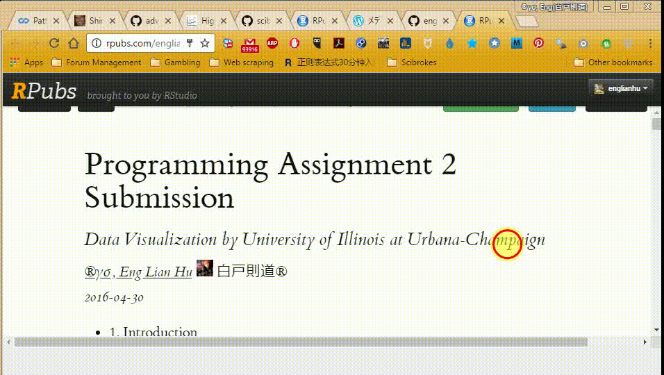
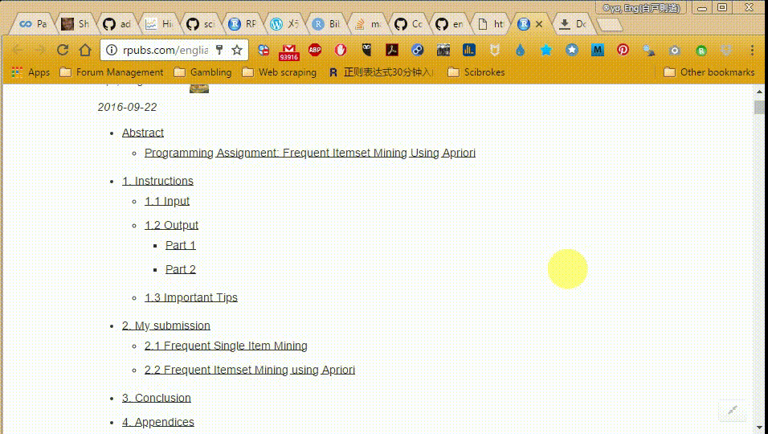

# Coursera Data Mining

[**Data Mining**](https://www.coursera.org/specializations/data-mining) *by University of Illinois at Urbana-Champaign*

## Assignment

  The courses content below chapters

  1. Data Visualization
    - 1.1 [Assignment 1](http://englianhu.github.io/2016/04/Programming%20Assignment%201%20Submission.html) (*Prefer Tebleau*)
    
    
    - 1.2 [Assignment 2](http://rpubs.com/englianhu/177151) (*Prefer Tebleau*)
    
    
  2. Text Retrieval and Search Engines
    - 2.1 [Assignment 1](https://beta.rstudioconnect.com/englianhu/Programming-Assignment-1-Submission/) (*Prefer Python*)
    
    
    - 2.2 [Assignment 2](https://beta.rstudioconnect.com/englianhu/Programming-Assignment-2-Submission/) (*Prefer Python*)

  3. Text Mining and Analytics
    - 3.1 Assignment (*Prefer Python*)
    
  4. Pattern Discovery in Data Mining
    - 4.1 [Assignment](http://rpubs.com/englianhu/pattern-discovery-in-data-mining-assignment1)
    
    
    
  5. Cluster Analysis in Data Mining
    - 5.1 Assignment
  
  6. Data Mining Capstone
    - 6.1 Assignment
    
## Quiz

  You can also open the folder inside specific topic to browse over the question and also answer of the quiz.

