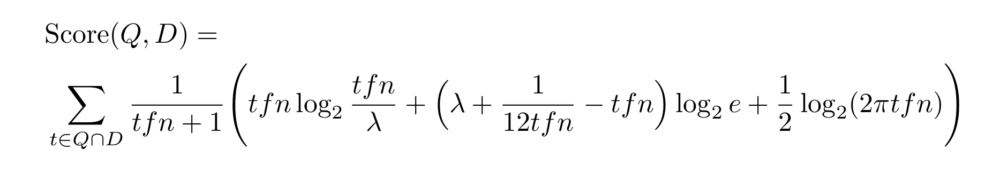
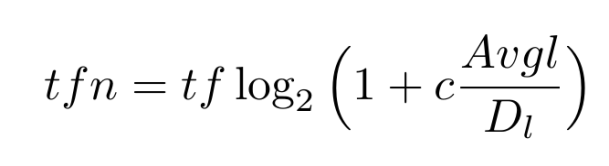

# 1. Introduction

  - Section [1.1 Assignment]
    - Section [1.1.1 MeTA Overview]
      - Section [1.1.1.1 Warm Up!]
      - Section [1.1.1.2 Task 1: Stopword Removal (5 pts)]
      - Section [1.1.1.3 Task 2: Stemming (10 pts)]
      - Section [1.1.1.4 Task 3: Part-of-Speech Tagging (10 pts)]
      - Section [1.1.1.5 Task 3.5: Writing a New Function (15 pts)]
    - Section [1.1.2 Build the Search Engine]
      - Section [1.1.2.1 Exploring the Dataset]
      - Section [1.1.2.2 Indexing]
      - Section [1.1.2.3 Searching]
      - Section [1.1.2.4 Task 4: BM25 (5 pts)]
      - Section [1.1.2.5 Task 5: BM25 with tuned parameters (10 pts)]
      - Section [1.1.2.6 Task 6: PL2 (30 pts)]
      - Section [1.1.2.7 Task 7: Tuning PL2 (20 pts)]
      - Section [1.1.2.8 Task 8: Relevance Judgments (20 pts)]
  - Section [1.2 Preparing Environment]

## 1.1 Assignment

**Instructions**

### 1.1.1 MeTA Overview

  Before starting the assignment, you are highly encouraged to read MeTA's system overview to gain a high level understanding of how MeTA operates. Throughout the assignments, if you want to know more about a certain class or function, you can use the search toolbar in MeTA's documentation, which provides a brief explanation of the different modules.
  
**My statistical tool for the assignment**
  
  Well, I am personally using ®Studio Linux Server CentOS7 for this assignment. Kindly refer to [为数据科学家们量身定做の专业统计软件 --- ®Studio服务器](https://beta.rstudioconnect.com/englianhu/Introducing-RStudio-Server-for-Data-Scientists/) to install your own ®Studio Server.

  If you have questions about the programming assignment, use the Programming Assignments Forum. This is a great place to ask questions and also help your fellow classmates.

**Downloading the Assignment**

1.  In what follows, we assume that you have already installed MeTA and the directory meta is located in `~/data/`.

  Download *Assignment_1.tar.gz* (below) and extract it into the parent directory of meta^[Kindly refer to [**MeTA: ModErn Text Analysis A Modern C++ Data Sciences Toolkit** - *CentOS Build Guide*](https://meta-toolkit.org/setup-guide.html#centos-build-guide) to install MeTA]. For example, if meta is in `~/data/`, then you should extract the assignment in `~/data/`

```{r list-files}
fls <- lapply(list.files('data'), function(x) list.files(paste0('data/', x)))
names(fls) <- list.files('data')
fls
```

  Now we try to list the files inside the folder as shown above.

```{r rm-1, include = FALSE}
rm(fls)
```

2.  In the terminal (*®Studio Server >> Menu >> Shell* or below codes with `system()` on R console), change the directory to *Assignment_1* and run the bash script Setup.sh^[Kindly refer to [Why do I need a tty to run sudo if I can sudo without a password?](http://unix.stackexchange.com/questions/122616/why-do-i-need-a-tty-to-run-sudo-if-i-can-sudo-without-a-password) if you faced the error: `> system('sudo bash setup.sh')
sudo: sorry, you must have a tty to run sudo`]. This can be done using the following two commands:

```{r setup-sh}
system('cd data/Assignment_1; ./setup.sh')
```

3.  Now using MeTA as a library to compile. Kindly run `bash-4.2$sudo yum install -y cmake3`^[If your installed cmake's version is 2.xx] via Shell to install `cmake3` prior to run below coding. Kindly *grant permission*^[Kindly refer to [How to set chmod for a folder and all of its subfolders and files in Linux Ubuntu Terminal?](http://stackoverflow.com/questions/3740152/how-to-set-chmod-for-a-folder-and-all-of-its-subfolders-and-files-in-linux-ubunt)] via terminal prior to run below codes.

```{r cmake3-01}
tryCatch(system('cd data/Assignment_1/build; cmake .. -DCMAKE_BUILD_TYPE=Release; make -j8'), error = function(err) print(err))
```

Download *Assignment_1.tar.gz*: [*Assignment_1.tar.gz*](https://d3c33hcgiwev3.cloudfront.net/_059c3c14eca1c6bcd7f71a397e279467_Assignment_1.tar.gz?Expires=1464480000&Signature=GULCCyN1w13Xy8KXde6M01ltKQUm79WiFM-JKRq1Kx0HC0iMk8-Y8VdXDMIytRNJDZ57bbeyDInvPDKsBBBO6BsJhuEIBRJnlx5xI45nUehd5bmZAfJ6yA2D2QJhNBzy1gdHrXTVpb35cI6G8jecQv2Pg23exA7GUpIvSxkNVX0_&Key-Pair-Id=APKAJLTNE6QMUY6HBC5A)

#### 1.1.1.1 Warm Up!

  In this section you will start by exploring some of the basic text processing techniques such as tokenization, stemming, and stopword removal. These techniques are usually applied to the corpus prior to the indexing stage. You will also perform part-of-speech tagging on a text document.

  Tokenization is the process of segmenting a stream of words (such as a document) into a sequence of units called tokens. Loosely speaking, when tokenization is performed on the word level, the tokens will be the words in the document. To perform tokenization, MeTA relies on the default segmentation boundaries between words and sentences defined by the Unicode Standard (see Unicode Standard Annex #29 for more information).

  Typically, after tokenization is performed, a number of text filtering techniques are applied on the tokens in order to perform more effective and efficient retrieval. These techniques include:

  - Stopword removal: Stopwords are frequent words that are not informative for the task at hand. For most retrieval applications, words such as "in," "or," "have," and "the" are not useful for identifying the relevant documents, and thus, they are discarded before the indexing stage. This considerably helps in reducing the size of the inverted index since stopwords occur very frequently and tend to have large postings lists. MeTA uses a list of stopwords saved in /meta/data/lemur-stopwords.txt. Feel free to open the file and have a look at some of the popular stopwords.

  - Conversion to lower case: For most applications, converting all letters to lower case can help in boosting the retrieval performance. The intuition here is that uppercase and lowercase forms of words usually refer to the same concept and should not be treated as orthogonal dimensions. However, this conversion can lead to inaccuracies in certain situations. For example, a proper noun like "CAT" (a construction company) will have the same representation as the common noun "cat."

  - Stemming: It is the process of converting words back to their original stems or roots. For example, the words "retrieve," "retrieval," and "retrieving" will all be mapped to the same root "retrieve." This can prevent different forms of the same word from being treated as orthogonal concepts. MeTA uses a very well known stemmer called the Porter2 English Stemmer; see English (Porter 2) stemming algorithm for more information on how this stemmer operates.

  Now you are ready to apply these concepts using MeTA!

#### 1.1.1.2 Task 1: Stopword Removal (5 pts)

  In this task you will run tokenization and stopword removal on a document. Go to *Assignment_1/build/Assignment1/*. You should find a text document called doc.txt. Open doc.txt and have a look at its content. The document contains the description found on [the main page of this course](https://www.coursera.org/course/textretrieval).

  In the terminal, perform the following:

```{r cmake3-02}
tryCatch(system('cd data/Assignment_1/build; cmake .. -DCMAKE_BUILD_TYPE=Release; make -j8; ./analyze ../config.toml Assignment1/doc.txt --stop'), error = function(err) print(err))
```

  After running the above, if everything is setup correctly, then you should see:

```
$ ./analyze ../config.toml Assignment1/doc.txt --stop
Running stopword removal -> 
  file saved as Assignment1/doc.stops.txt
```

  Open the output file *Assignment_1/build/Assignment1/doc.stops.txt* and you should see how tokenization and stopword removal have been applied.

  In the 2nd command above, you have executed a compiled program called analyze and passed to it a configuration file called *config.toml*, the document's path, and the parameter "stop," which tells the program to remove stopwords. The analyze is a demo program that supports multiple text analysis functions. Passing *config.toml* to programs in MeTA is a default practice as it gives the program all the required parameters to run.

  Open *Assignment_1/config.toml* and examine it. You should see a list of configuration parameters, including the directory of the list of stopwords (which should appear in the first line). If you have a new list of stopwords, you can simply point MeTA to it (but do not change the list for this assignment).

  After finishing Task 1, you should submit the output file using the submission script. In the shell, execute:

```{r cmake3-stopwords}
tryCatch(system("cd Assignment_1/build/Assignment1; wc  < doc.stops.txt | sed 's/^\\s*//g' > doc.stops.txt.wc"), error=function(err) print(err))
```

  Submit the file *docs.stops.txt.wc* to Task 1. In the My submission tab, click + Create submission. Then click on *Task 1: Stopword Removal* and upload your file.

#### 1.1.1.3 Task 2: Stemming (10 pts)

  Now you will perform tokenization and stemming on the same document *doc.txt*. The analyze program you ran in Task 1 provides several other text analysis functionalities, including stemming. For the different functions implemented in analyze, open *Assignment_1/analyze.cpp* and have a look. In addition, simply run *./analyze* and you should see:

```
$ ./analyze
Usage: ./analyze config.toml file.txt [OPTION]
where [OPTION] is one or more of:        
  --stem  perform stemming on each word        
  --stop  remove stopwords        
  --stopstem      remove stopwords and perform stemming        
  --pos   annotate words with POS tags        
  --pos-replace   replace words with their POS tags        
  --parse create grammatical parse trees from file content          
  --freq-unigram  sort and count unigram words        
  --freq-bigram   sort and count bigram words        
  --freq-trigram  sort and count trigram words        
  --all   run all options
```

  Your task is to perform stemming on *doc.txt* using the analyze program.

  After running stemming, you should see a new file named doc.stems.txt in output directory *Assignment_1/build/Assignment1/*. Examine the file and see how words are mapped back to their stems.

  Now do the word count again and

```{r stemming}
tryCatch(system("wc  < doc.stems.txt  | sed 's/^\\s*//g' > doc.stems.txt.wc"), error = function(err) print(err))
```

  Submit your output file *doc.stems.txt.wc*. In the My submission tab, click + Create submission. Upload your file to *Task 2: Stemming*.

#### 1.1.1.4 Task 3: Part-of-Speech Tagging (10 pts)

  As you have learned in the lecture on natural language processing, part-of-speech tagging is the process of assigning parts of speech (such as verb, noun, adjective, adverb, etc.) to the words in a given text. Your task is to do POS tagging (without replacement) on *doc.txt* using the analyze program. After executing the program, examine the output in *doc.pos-tagged.txt*. You should see how a POS tag is assigned to each word after the underscore. Note that the tags are abbreviated; for example, the tag "NN" stands for a noun. For a list of commonly used tags and their meanings see the UPenn Treebank list. For a more comprehensive covering of POS tagging, you can check MeTA's POS Tagging Tutorial. Don't forget to submit your output file after running the following!

```{r tagging}
tryCatch(system("wc  <  doc.pos-tagged.txt  | sed 's/^\\s*//g' >  doc.pos-tagged.txt.wc"), error=function(err) print(err))
```

#### 1.1.1.5 Task 3.5: Writing a New Function (15 pts)

  Now that you have explored some of the basic text analysis techniques in analyze, you will add a new function to analyze that does stopword removal followed by stemming on the same text document.

  MeTA implements the different text analysis techniques such as stemming and stopword removal as filters that can be chained together. See [MeTA's filters Reference](https://meta-toolkit.github.io/meta/doxygen/namespacemeta_1_1analyzers_1_1filters.html) for a list of the different supported filters.

  To implement your new function, edit *Assignment_1/analyze.cpp*. Examine and try to understand how the functions stem and stop are performing tokenization and filtering.

  Find the function:

```
void stopstem(const std::string& file, 
              const cpptoml::table& config)
```

  Your task is to complete the function in order to perform the required task. In the place where we wrote:

```
// Insert the line required to do stopword removal here
// Insert the line required to do stemming here (using Porter2 Stemmer)
```

  You should only add the stopword removal filter and the Porter2 stemming filter. (2 Lines in total) Do not add any other filters.

  Since source code is changed, you should recompile after writing your code:

```{r cmake-function}
tryCatch(system('cd Assignment_1/build; cmake .. -DCMAKE_BUILD_TYPE=Release; make -j8; ./analyze ../config.toml Assignment1/doc.txt --stopstem'), error = function(err) print(err))
```

  and we still ask you to run

```{r write-function}
tryCatch(system("wc  <  doc.stopstem.txt | sed 's/^\\s*//g' >  doc.stopstem.txt.wc"), error = function(err) print(err))
```

  and submit your result.

### 1.1.2 Build the Search Engine

  In this section, you will perform and experiment with indexing and retrieval on a special dataset called the MOOCs dataset.

#### 1.1.2.1 Exploring the Dataset

  The MOOCs dataset contains the descriptions found on the webpages of around 23,000 MOOCs (Massive Open Online Courses). You will start by exploring the dataset. Navigate to `Assignment_1/moocs`. This directory contains the files that describe the dataset.

  - *moocs.dat* contains the content of the webpages of all the MOOCs; each MOOC's main page occupies exactly one line in the file. Feel free to open the file to get an idea about the contents, but be wary that it is a large file and might take some time to load.
  - *moocs.dat.names* contains the names and the URLs of the MOOCs. The entry on line x in *moocs.dat.names* corresponds to the MOOC on line x in *moocs.dat*.
  - *moocs-queries.txt* contains a set of queries that you will use to evaluate the effectiveness of your search engine.
  - *moocs-qrels.txt* contains the relevance judgments corresponding to the queries in *moocs-queries.txt*. Each line in *moocs-qrels.txt* has the following format: (querynum documentID 1). This means that the document represented by documentID is a relevant document for the query whose number is querynum. The relevance judgments in *moocs-qrels.txt* were created by human assessors who ran the queries and chose the relevant documents. Later on in the assignment, you are going to use these judgments to quantify the performance of your search engine.

#### 1.1.2.2 Indexing

  Now that you have an idea about tokenization, text filtering, and the dataset to be used, you will proceed to index the MOOCs dataset. In this process, an inverted index will be created. As you have seen in the lectures, the inverted index is a data structure that supports efficient retrieval of documents by allowing the lookup of all the documents that contain a specific term.

  Before you proceed to index the dataset, we encourage you to open config.toml and examine the settings that we have already configured. For instance, the snippet shown below tells the indexer where to find the MOOCs dataset, specifies that it is a line corpus (i.e., each document is on one line), and defines the name of the inverted index to be created. The forward index will not be used in this assignment.

```
query-judgements = "../../meta/data/moocs/moocs-qrels.txt" 
querypath = "../../meta/data/moocs/" 
corpus = "line.toml" 
dataset = "moocs" 
forward-index = "moocs-fwd" 
inverted-index = "moocs-inv" 
```

  You should also have a look at another important snippet:

```
[[analyzers]]
method = "ngram-word"
ngram = 1
filter = "default-unigram-chain"
```

  The settings under the analyzers tag control how tokenization and filtering are performed, prior to creating the inverted index. The tokenizer will segment each document into unigrams. MeTA uses its default filtering chain, which performs a couple of predefined filters including lower case conversion, length filtering (which discards tokens whose length is not within a certain range), and stemming. To read more about modifying META's default tokenization and filtering behavior see MeTA's analyzers and filters page.

  To index the dataset, in the `Assignment_1/build` directory run:

```
../../meta/build/index ../config.toml
```

  (index program is in the `meta/build` directory under root). You should see something like below:

```
$ ./meta/build/index ../config.toml
1463154868: [info]     Loading index from disk: moocs-inv (root/meta/src/index/inverted_index.cpp:178)
Number of documents: 23566
Avg Doc Length: 383.014
Unique Terms: 193614
Index generation took: 0.007 seconds
```

  This will start by performing tokenization and applying the text filters defined in config.toml; it then creates the inverted index and places it in/meta/build/moocs-inv. When the program finishes execution, you should get a summary of the indexed corpus as above

#### 1.1.2.3 Searching

  After creating the inverted index, you can efficiently search the MOOCs dataset. The ranking function to be used in retrieving documents is defined in *config.toml*. Open *config.toml* and look for the ranker tag. Under this tag, you will see that the default ranker is "bm25" along with values assigned to its three parameters. To test your search engine, you can use the interactive-search program provided with MeTA:

```{r search}
tryCatch(system('cd Assignment_1/build; ../../meta/build/interactive-search ../config.toml'), error=function(err) print(err))
```

  Enter any query you want, and the top results should show up instantaneously. Feel free to experiment with different queries to explore the contents of the dataset.

  When you finish, enter a blank query to exit.

  In what follows you will evaluate the performance of the search engine using different ranking functions and parameters. The main evaluation measure to be used is MAP (mean average precision), which is the arithmetic mean of the average precision of all the queries being used for evaluation. We have provided you with a program called ranking-experiment which evaluates the MAP of any retrieval function you specify in *config.toml*.

#### 1.1.2.4 Task 4: BM25 (5 pts)

  Evaluate the performance of bm25 with default parameters (i.e., do not change *config.toml*) by running:

```{r BM25}
tryCatch(system('cd Assignment_1/build; ./ranking-experiment ../config.toml task4'), error = function(err) print(err))
```

  You should see a list of the top results corresponding to the different test queries, the precision at 10 for each query, and the final MAP value.

  At the same time, we create a output file for you to submit: */Assignment_1/build/Assignment1/task4.txt*

  Submit *task4.txt*.

#### 1.1.2.5 Task 5: BM25 with tuned parameters (10 pts)

Change the parameter b of bm25 in *config.toml* to 0.75

```
ranker] 
method = "bm25" 
k1 = 1.2 
b = 0.75 
k3 = 500
```

  and run again:

```{r tuned-BM25}
tryCatch(system('cd Assignment_1/build; ./ranking-experiment ../config.toml task5'), error = function(err) print(err))
```

  and submit your */Assignment_1/build/Assignment1/task5.txt*

#### 1.1.2.6 Task 6: PL2 (30 pts)

  MeTA has several built-in rankers other than bm25; see MeTA's Index Reference page and the directory meta/src/index/ranker for the list of built-in rankers. In this task you will implement a well known retrieval function called PL2, which is not available in MeTA. PL2 is a member of the Divergence from Randomness framework, which is based on the idea that the more different the within-document term frequency is from the term frequency generated by a random process, the higher the information content of the term is. PL2's scoring function is given by:



*equation 01: PL2's scoring function*

  where



*equation 02: term frequency*

  and $tf$ is the term frequency in the document, $Avgl$ is the average document length in the whole corpus, $Dl$ is the document length, and $λ$ and $c$ are positive tunable parameters.

  Every ranking function in MeTA should have its own class that subclasses the base class ranker. Go to [MeTA's ranker Class Reference](https://meta-toolkit.github.io/meta/doxygen/classmeta_1_1index_1_1ranker.html) and have a quick look at the member functions of ranker. One important function in ranker you should be aware of is:

```
float score_one(const index::score_data&) override;
```

  which calculates the ranking score of one matched term. That is, if the scoring function is written as


*equation 03: scoring function*

  where t is a matched term and $w(t,Q,D)$ is the score of that term, then $score_one = w(t,Q,D)$. After each call to $score_one$, the result will be added to the document's accumulator, which is responsible for returning the final document score.

  The struct of type $score_data$ passed as a parameter to $score_one$ contains important statistics about the matched term (such as the number of occurrences in the document and the document length) and other global statistics like the average document length in the corpus. For more information on the members of this struct, check MeTA's $score_data$ Reference.

  Now that you have a basic understanding of the base class ranker and the function $score_one$, you should be able to implement the PL2 ranking function. Go to `meta/src/index/tools/` and open *ranking-experiment.cpp* in a text editor or IDE. We have already provided a code that creates a new ranker class called "*pl2_ranker.*" As you can see, "*pl2_ranker*" is a derived class from the base class ranker. Examine the members of "*pl2_ranker*" and the comments next to them.

  Your task is to complete the implementation of the function:

```
float score_one(const index::score_data&)
```

  in order to return the score defined by PL2. Make sure to follow the instructions provided as comments in the body of the function.

  In addition, in *config.toml*, change the ranker to "pl2" with appropriate parameters. In below, we use "#" to comment out lines that we don't need.

```
[ranker]
#method = "bm25"
#k1 = 1.2
#b = 0.75
#k3 = 500
method = "pl2"
c = 7
lambda = 0.1
```

  Now, you need to recompile the code again:

```{r PL2}
tryCatch(system('cd Assignment_1/build; cmake .. -DCMAKE_BUILD_TYPE=Release; make -j8; ./ranking-experiment ../config.toml task6'), error = function(err) print(err))
```

  And again, submit your results */Assignment_1/build/Assignment1/task6.txt*

#### 1.1.2.7 Task 7: Tuning PL2 (20 pts)

  In this task you will tune the PL2 ranking function in order to get better values of $c$ and $λ$. Open *ranking-experiment.cpp*, and look for the function “*pl2_tune.*” This function is expected to sweep over pairs of the parameters $c$ and $λ$ and select the pair that gives the highest MAP. However, the function has a few incomplete lines:

```
maxmap = 0; // Change 0 to the correct value
cmax = 0; // Change 0 to the correct value
lambdamax = 0; // Change 0 to the correct value
```

  Read the comments beside the function's code and try to understand how it works. After that, change the values in the incomplete lines.

  You should now recompile MeTA and run ranking-experiment:

```{r tuned-PL2}
tryCatch(system('cd Assignment_1/build; cmake .. -DCMAKE_BUILD_TYPE=Release; make -j8; ./ranking-experiment ../config.toml task7'), error = function(err) print(err))
```

  ranking-experiment will then return the maximum MAP along with the optimal parameters $λ$ and $c$ that achieve this maximum. You should see a noticeable improvement in the MAP over what you got in Task 6.

  And again, submit your results */Assignment_1/build/Assignment1/task7.txt*

  After you finish Task 7, open *config.toml* and revert to bm25 as the default ranker. You can do this by removing the hash symbols preceding bm25 and its parameters and adding hash symbols to pl2 and its parameters.

#### 1.1.2.8 Task 8: Relevance Judgments (20 pts)

  The next programming assignment will be a competition where your search engine will be evaluated based on relevance judgments made by all the students in this course. Relevance judgments are query-document pairs marked as relevant or irrelevant by users. We expect to collect a large and diverse pool of judgments, which should allow a fair evaluation of your search engines in the second assignment.

  For this purpose, you are required to come up with a query about a topic you would like to study in an online course. The query can be something like "information retrieval." You should also write a brief description of what you expect to learn from the course you are searching for. For example, one description is "To learn how to efficiently do retrieval from large datasets." In the terminal, execute:

```{r judgments}
tryCatch(system('cd Assignment_1/build; ./relevance-judgements ../config.toml'), error = function(err) print(err))
```

  You should perform the following steps after running relevance-judgements:

1.  Enter the query of your choice.
2.  Enter a description of what you are expecting to learn. You will be shown a list of the top 20 MOOCs corresponding to your query.
3.  Enter the numbers of the relevant MOOCs separated by spaces.

  In case you could not find any relevant documents for your query, try another one. Also, feel free to submit more than one query as this should help more in the competition.

  The relevance judgments you came up with are saved in a file called *task8.txt*. You can take a look at its content, but do not modify it.

  Submit your */Assignment_1/build/Assignment1/task8.txt*. Submit the file *docs.stops.txt.wc* to partTask 1. In the My submission tab, click Createsubmission. Then click on Task 1: Stopword Removal and upload your file.

## 1.2 Preparing Environment

  Loading packages.

```{r load-packages, cache=TRUE}
## Loading the package 'BBmisc'
#'@ if(suppressMessages(!require('BBmisc'))) install.packages('BBmisc', repos = 'https://cran.rstudio.com')
#'@ suppressMessages(library('BBmisc'))
#'@ suppressMessages(library('plyr'))

pkgs <- c('plyr', 'dplyr', 'magrittr', 'tidyr', 'googleVis', 'htmltools', 'rCharts', 'DT', 'lubridate', 'data.table', 'quanteda', 'stringr', 'stringi', 'tufte')
#'@ suppressAll(lib(pkgs)) 

suppressMessages(lapply(pkgs, library, character.only = TRUE))
rm(pkgs)
```

  Setup and setting adjustment.

```{r setting adjustment, include = FALSE}
options(rpubs.upload.method = 'internal')

## knitr configuration
# invalidate cache when the tufte version changes
suppressMessages(library('knitr'))

opts_chunk$set(tidy = TRUE, fig.path = 'figure/', comment = NA, message = FALSE, cache.extra = packageVersion('tufte'), echo = TRUE, progress = TRUE)#, fig.align = 'center', fig.keep = 'high', fig.width = 10, fig.height = 6)
```

```{r clear-memory, include = FALSE}
## clear memory cache to lease the memory capacity ease
gc()
```

# 2. Data

  - Section [2.1 Collecting Data]
  - Section [2.2 Read Data]
  - Section [2.3 Process Data]

## 2.1 Collecting Data

  The dataset is downloadable in zipped file via [Assignment_1.tar.gz](https://d3c33hcgiwev3.cloudfront.net/_059c3c14eca1c6bcd7f71a397e279467_Assignment_1.tar.gz?Expires=1464480000&Signature=GULCCyN1w13Xy8KXde6M01ltKQUm79WiFM-JKRq1Kx0HC0iMk8-Y8VdXDMIytRNJDZ57bbeyDInvPDKsBBBO6BsJhuEIBRJnlx5xI45nUehd5bmZAfJ6yA2D2QJhNBzy1gdHrXTVpb35cI6G8jecQv2Pg23exA7GUpIvSxkNVX0_&Key-Pair-Id=APKAJLTNE6QMUY6HBC5A).

```{r collect-data, echo = FALSE}
suppressMessages(library('plyr'))
suppressMessages(library('dplyr'))
suppressMessages(library('magrittr'))
suppressMessages(library('formattable'))
suppressMessages(library('knitr'))
suppressMessages(library('sparkline'))

## The deafult of path when we 'knit' is depends on the location of the rmarkdown file but it will depends on project's path if we are running the codes by chunk.
if(!file.exists('./data')) dir.create('./data')

if(!file.exists('./data/Assignment_1.tar.gz')) {
  download.file('https://d3c33hcgiwev3.cloudfront.net/_059c3c14eca1c6bcd7f71a397e279467_Assignment_1.tar.gz?Expires=1464480000&Signature=GULCCyN1w13Xy8KXde6M01ltKQUm79WiFM-JKRq1Kx0HC0iMk8-Y8VdXDMIytRNJDZ57bbeyDInvPDKsBBBO6BsJhuEIBRJnlx5xI45nUehd5bmZAfJ6yA2D2QJhNBzy1gdHrXTVpb35cI6G8jecQv2Pg23exA7GUpIvSxkNVX0_&Key-Pair-Id=APKAJLTNE6QMUY6HBC5A', destfile = './data/Assignment_1.tar.gz')
  }

## Unzip the file
untar('./data/Assignment_1.tar.gz')

## list down the details of the zipped file
df <- untar('./data/Assignment_1.tar.gz', list = TRUE) %>% data.frame %>% tbl_df %>% mutate(Length = nchar(as.character(.)))
names(df) <- c('File', 'Length')

## stylise the ranking
df <- formattable(
  df, list(
    Length = formatter("span",
    style = x ~ style(color = ifelse(rank(-x) <= 3, "gold", "silver")),
    x ~ sprintf("%.2f (rank: %02d)", x, rank(-x)))
    )
  )

## http://stackoverflow.com/questions/35922583/setting-the-width-of-formattable-object
#  so what happens is a formattable object
#   gets converted to an htmlwidget
#   for viewing when interactive
#  to specify a width
#   we have to do the htmlwidget conversion ourselves
#   with as.htmlwidget
as.htmlwidget(df)#, width=400) #NOTE: once we apply the function, whole background color will became white color!!!
```

  *table 2.1.1 : Summary of downloaded zipped file.*

```{r rm-objs1, include = FALSE}
rm(df)
```

  From above information, we can know the information of the zipped files.

## 2.2 Read Data

 Read data.  

```{r read-files, echo = FALSE, comment = NA, cache = FALSE}
suppressMessages(library('plyr'))
suppressMessages(library('dplyr'))
suppressMessages(library('data.table'))
suppressMessages(library('readr'))

## http://blog.revolutionanalytics.com/2015/04/new-packages-for-reading-data-into-r-fast.html
#'@ dat <- read_table(file = './Assignment_1/Assignment1/doc.txt')
#'@ dat1 <- dat %>% names %>% paste0(collapse = ' ') %>% str_replace_all('\\sNA|NA|NA\\s', '')
#'@ dat2 <- dat %>% unlist %>% paste0(collapse = ' ') %>% str_replace_all('\\sNA|NA|NA\\s', '')

## Due to the dataset is not large, here I apply readLines will be easier.
dat <- suppressWarnings(readLines('Assignment_1/Assignment1/doc.txt'))
stri_stats_general(dat) %>% kable(caption = 'Summary of the text dataset')
```

```{r join-data}
## join to be one paragraph/element of vector.
dat %<>% paste0(collapse = '')
dat
```

  As stated in the assignment, we can apply below codes to remove all white spaces inside the string if we are using `readChar()`. Well, I am using `readLines()` and there has no characters such as `\n` nor `\r` in my dataset which has shown above.

```{r stopwords}
gsub('s/^\\s*//g', '', dat, perl = TRUE)
```

```{r unlink, include = FALSE}
## Delete the data folders to save the capacity.
unlink('./data/Assignment_1', recursive = TRUE)
```

```{r clear-memory, include = FALSE}
```

## 2.3 Process Data

  Due to the dataset might occupy quite some space, therefore I've displayed the process and also the result on web.
  
  Besides, here I follow the instruction of the assignment to filter the dataset : 
  
  - **Stopword removal** : `ignoredFeatures = stopwords('english')`
  - **Conversion to lower case** : `toLower = TRUE`
  - **Stemming** : `stem = TRUE`
  
```{r }
suppressMessages(library('quanteda'))

## corpus the text.
corpUS <- corpus(dat)

## Create n-grams Tokenization and transfer to dfm (Document Feature Matrix)
mydfm <- dfm(corpUS, verbose = TRUE, toLower = TRUE, removeTwitter = TRUE, removePunct = TRUE,
              removeNumbers = TRUE, ignoredFeatures = stopwords('english'), stem = TRUE)

corpUS <- collocations(corpUS, method = 'lr') %>% data.frame %>% tbl_df
```

# 3. Data Visulaization

  - Section [3.1 Data Table]
    - Section [3.1.1 Functional Table]
    - Section [3.1.2 stylish Table]
  - Section [3.2 Shiny App]

## 3.1 Data Table

  Now we look at our data set in table format.

### 3.1.1 Functional Table

  The table has few functions which allow you to print, save etc.

```{r datatable1a, echo = FALSE, comment = NA, cache = FALSE}
suppressMessages(library('DT'))

datatable(corpUS, 
  caption="Table 3.1.1 : Word Preditive Table", escape = FALSE, filter = "top", rownames = FALSE, 
  extensions = list("ColReorder" = NULL, "RowReorder" = NULL, 
                    "Buttons" = NULL, "Responsive" = NULL, 
                    "FixedColumns" = list(leftColumns = 1)), 
  options = list(dom = 'BRrltpi', autoWidth = TRUE, 
                 lengthMenu = list(c(10, 50, 100, -1), c('10', '50', '100', 'All')), 
                 ColReorder = TRUE, rowReorder = TRUE, 
                 buttons = list('copy', 'print', 
                                list(extend = 'collection', 
                                     buttons = c('csv', 'excel', 'pdf'), 
                                     text = 'Download'), I('colvis')))
    ) %>% 
  formatStyle(
    'word1',
    transform = 'rotateX(1deg) rotateY(1deg) rotateZ(0deg) rotateX(1deg) rotateY(1deg) rotateZ(0deg) rotateX(1deg) rotateY(1deg) rotateZ(0deg) rotateX(1deg) rotateY(1deg) rotateZ(0deg) rotateX(1deg) rotateY(1deg) rotateZ(0deg) rotateX(1deg) rotateY(1deg) rotateZ(0deg) rotateX(1deg) rotateY(1deg) rotateZ(0deg) rotateX(1deg) rotateY(1deg) rotateZ(0deg) rotateX(1deg) rotateY(1deg) rotateZ(0deg) rotateX(1deg) rotateY(1deg) rotateZ(0deg) rotateX(1deg) rotateY(1deg) rotateZ(0deg) rotateX(1deg) rotateY(1deg) rotateZ(0deg) rotateX(1deg) rotateY(1deg) rotateZ(0deg) rotateX(1deg) rotateY(1deg) rotateZ(0deg) rotateX(1deg) rotateY(1deg) rotateZ(0deg) rotateX(1deg) rotateY(1deg) rotateZ(0deg) rotateX(1deg) rotateY(1deg) rotateZ(0deg) rotateX(1deg) rotateY(1deg) rotateZ(0deg) rotateX(1deg) rotateY(1deg) rotateZ(0deg) rotateX(1deg) rotateY(1deg) rotateZ(0deg) rotateX(1deg) rotateY(1deg) rotateZ(0deg) rotateX(1deg) rotateY(1deg) rotateZ(0deg) rotateX(1deg) rotateY(1deg) rotateZ(0deg) rotateX(1deg) rotateY(1deg) rotateZ(0deg)',
    backgroundColor = styleEqual(
      unique(corpUS$word1[duplicated(corpUS$word1)]), c('lightblue', 'lightgreen', 'aquamarine', 'lightyellow', 'blanchedalmond ', 'cornflowerblue ', 'gold', 'red', 'gray', 'orange', 'yellow', 'blueviolet', 'burlywood', 'coral', 'brown', 'cornsilk', 'crimson', 'cyan', 'darkblue', 'darkcyan', 'darkgoldenrod', 'darkgrey', 'darkgreen', 'darkorange')
    )
  ) %>% 
  formatStyle(
    'count',
    color = styleInterval(c(2, 4), c('white', 'blue', 'red')),
    backgroundColor = styleInterval(2, c('darkgoldenrod', 'moccasin'))
  ) %>%
  formatStyle(
    'G2',
    color = styleInterval(c(10, 20), c('white', 'blue', 'red')),
    backgroundColor = styleInterval(10, c('gold', 'darkgoldenrod'))
  )
```

  *table 3.1.1 : Word Predictive Table.*

### 3.1.2 stylish Table

  The table display with theme.

```{r datatable1b, results = 'asis', echo = FALSE, comment = NA, cache = FALSE}
suppressMessages(library('rCharts'))

dt1 <- dTable(corpUS, sPaginationType = "full_numbers", iDisplayLength = 10, sScrollX = "100%")

## http://bl.ocks.org/ramnathv/raw/8084330/
dt1$show('iframesrc', cdn = TRUE)
#'@ dt1$show('inline', include_assets = TRUE) #keep loading but unable display anything
#'@ dt1$show('inline', include_assets = TRUE, cdn = TRUE) #blank table frame shown
```

  *table 3.2.1 : Word Predictive Table.*

```{r clear-memory, include = FALSE}
```

## 3.2 Shiny App

```{r shinyapp, echo = FALSE, results = 'asis'}
library('shiny')
library('shinyjs')
library('DT')
library('plyr')
library('dplyr')
library('magrittr')
library('stringi')
library('lubridate')

# Define UI for application that draws a histogram
ui <- fluidPage(
  shinyjs::useShinyjs(),
  shinyjs::inlineCSS(list(.big = "font-size: 2em")),
  div(id = "myapp",
      h2("Coursera Data Mining - Text Retrieval and Search Engines"),
      checkboxInput("big", "Bigger text", FALSE),
      textInput("name", "Text Input :", ""),
      p('You can type up to 2 words in sequence with space as system will auto detect the word(s) and suggest you the best predictive next word in table format.'),
      a(id = "toggleAdvanced", "Show/hide advanced info", href = "#"),
      shinyjs::hidden(
        div(id = "advanced",
            p('- Author Profile:', HTML("<a href='https://beta.rstudioconnect.com/englianhu/ryo-eng/'>®γσ, Eng Lian Hu</a>")),
            p('- GitHub:', HTML("<a href='https://github.com/englianhu/Coursera-Data-Mining/tree/master/Text%20Retrieval%20and%20Search%20Engines'>Source Code</a>"))
        )
      ),
      p("Timestamp: ",
        span(id = "time", date()),
        a(id = "update", "Update", href = "#")
      ),
      actionButton("reset", "Reset form")
  ),
  mainPanel(
    verbatimTextOutput('text1'),
    verbatimTextOutput('text2'),
    br(),
    div(id = "bestMatch", p('The best match next predictive word is :', htmlOutput('text3'))),
    hr(),
    DT::dataTableOutput('table')
  )
)

server <- function(input, output) {

  shinyjs::onclick("toggleAdvanced",
                   shinyjs::toggle(id = "advanced", anim = TRUE))    
  
  shinyjs::onclick("update", shinyjs::html("time", date()))
  
  observe({
    shinyjs::toggleClass("bestMatch", "big", input$big)
  })
  
  output$text1 <- renderText({
    if(!is.null(input$name) & input$name != "")
      mydfm = mydfm
    else
      mydfm = 0
    
    paste0('Document-feature matrix of: ', 
           as.character(dim(mydfm))[1], 
           ' documents, ', as.character(dim(mydfm))[2], ' features.')
  })

  output$text2 <- renderText({
    if(!is.null(input$name) & input$name != "")
      mydfm = mydfm
    else
      mydfm = 0
    paste0('Document-feature matrix of: ', 
           as.character(dim(mydfm))[1], 
           ' documents, ', as.character(dim(mydfm))[2], ' features.')
  })
  
  output$table <- DT::renderDataTable({
    ## http://rpubs.com/Hsing-Yi/176027
    #'@ if(!is.null(input$name) | input$name != "") {
      criteria = strsplit(input$name, ' ')[[1]]
      
      len = length(criteria)
      if(len == 1) {
        corpUS %<>% filter(word1 == criteria[1]) %>% tbl_df
      } else if(len == 2) {
        corpUS %<>% filter(word1 == criteria[1] & 
                           word2 == criteria[2]) %>% tbl_df
      #'@ } else if(len == 3) {
      #'@   corpUS %<>% filter(word1 == criteria[1] & 
      #'@                    word2 == criteria[2] & 
      #'@                    word3 == criteria[3]) %>% tbl_df
      } else {
        corpUS = data.frame() %>% tbl_df
      }
    DT::datatable(corpUS)
  })
  
  output$text3 <- renderText({
    ## http://rpubs.com/Hsing-Yi/176027
    #'@ if(!is.null(input$name) | input$name != "") {
    criteria = strsplit(input$name, ' ')[[1]]
    
    len = length(criteria)
    if(len == 1) {
      corpUS %<>% filter(word1 == criteria[1]) %>% tbl_df %>% .[1, 2] %>% unlist
    } else if(len == 2) {
      corpUS %<>% filter(word1 == criteria[1] & 
                           word2 == criteria[2]) %>% tbl_df %>% .[1, 3] %>% unlist
    #'@ } else if(len == 3) {
    #'@   corpUS %<>% filter(word1 == criteria[1] & 
    #'@                        word2 == criteria[2] & 
    #'@                        word3 == criteria[3]) %>% tbl_df %>% .[1, ]
    } else {
      corpUS = 'Unknown predictive next word.'
    }
    return(corpUS)
  })
  
  observeEvent(input$reset, {
    shinyjs::reset("myapp")
  })    
  }

shinyApp(ui, server)
```

# 4. Conclusion

  This assignment is similar with my previous assignment. You are feel free to refer to my previous Capstone project at Data Science via [Final-Project-Submission](https://beta.rstudioconnect.com/englianhu/Final-Project-Submission/).

# 5. Appendices

  - Section [5.1 Documenting File Creation]
  - Section [5.2 Versions' Log]
  - Section [5.3 Speech and Blooper]
  - Section [5.4 References]

## 5.1 Documenting File Creation

  It's useful to record some information about how your file was created.
  
  - File creation date: 2016-05-28
  - File latest updated date: `r Sys.Date()`
  - `r R.version.string`
  - R version (short form): `r getRversion()`
  - [**rmarkdown** package]() version: `r packageVersion('rmarkdown')`
  - [**tufte** package](https://github.com/rstudio/tufte) version: `r packageVersion('tufte')`
  - File version: 1.0.0
  - Author Profile: [®γσ, Eng Lian Hu](https://beta.rstudioconnect.com/englianhu/ryo-eng/)
  - GitHub: [Source Code](https://github.com/englianhu/Coursera-Data-Mining/tree/master/Text%20Retrieval%20and%20Search%20Engines)
  - Additional session information:

```{r info, echo=FALSE, results='asis'}
lubridate::now()
devtools::session_info()$platform
Sys.info()
```

## 5.2 Versions' Log

  - *May 28, 2016*: [version: 1.0.0](https://github.com/englianhu/Coursera-Data-Mining/tree/master/Text%20Retrieval%20and%20Search%20Engines)

## 5.3 Speech and Blooper

  The text mining course is similar with my previous project as stated in references section. Kindly **right click and open the link as new tab** in case of **directly click** on the hyperlink doesn't work. There are a lot of black magic coding which conducted (*remote control* via **artificial neural network**) by [shaman/witch JiGong Master](https://www.google.com.my/maps/@3.3442186,101.2544971,3a,75y,274.5h,89.67t/data=!3m6!1e1!3m4!1sK0d1g6Vx93YYbI28-wi7Bw!2e0!7i13312!8i6656!6m1!1e1) and [shaman/witch Hwa Chai ](https://www.google.com.my/maps/@3.3157811,101.2765881,3a,75y,235.6h,77.54t/data=!3m6!1e1!3m4!1sAiGMMkXESPSL0Qpwl4h-Kw!2e0!7i13312!8i6656!6m1!1e1). Kindly refer to below coding to know one among them.
  - The file *CMakeLists.txt* exactly locate at the mentioned path but system showing error which unable found the file.
```
bash-4.2$ cmake3 .. -DCMAKE_BUILD_TYPE=Release; make -j8
CMake Error: The source directory "/home/ryoeng/englianhu/Coursera-Data-Mining/Text Retrieval and Search Engines" does not appear to contain CMakeLists.txt.
```
  - The permission granted and even though ownership changed, keep facing permission error to run the `cmake` command.
  


```{diff}
> system('cd data/Assignment_1/build; cmake .. -DCMAKE_BUILD_TYPE=Release; make -j8')
-- Searching for ICU 56.1
-- ICU version found is 50.1.2, expected 56.1; attempting to build ICU from scratch...
CMake Error: Could not open file for write in copy operation /home/ryoeng/englianhu/Coursera-Data-Mining/Text Retrieval and Search Engines/data/meta/deps/icu/src/ExternalICU-stamp/ExternalICU-urlinfo.txt.tmp
CMake Error: : System Error: Permission denied
CMake Error at /usr/local/share/cmake-3.2/Modules/ExternalProject.cmake:1801 (configure_file):
  configure_file Problem configuring file
Call Stack (most recent call first):
  /usr/local/share/cmake-3.2/Modules/ExternalProject.cmake:2321 (_ep_add_download_command)
  /home/ryoeng/englianhu/Coursera-Data-Mining/Text Retrieval and Search Engines/data/meta/deps/meta-cmake/FindOrBuildICU.cmake:73 (ExternalProject_Add)
  /home/ryoeng/englianhu/Coursera-Data-Mining/Text Retrieval and Search Engines/data/meta/CMakeLists.txt:43 (FindOrBuildICU)


CMake Error at /usr/local/share/cmake-3.2/Modules/ExternalProject.cmake:837 (file):
  file failed to open for writing (Permission denied):

    /home/ryoeng/englianhu/Coursera-Data-Mining/Text Retrieval and Search Engines/data/meta/deps/icu/src/ExternalICU-stamp/download-ExternalICU.cmake
Call Stack (most recent call first):
  /usr/local/share/cmake-3.2/Modules/ExternalProject.cmake:1832 (_ep_write_downloadfile_script)
  /usr/local/share/cmake-3.2/Modules/ExternalProject.cmake:2321 (_ep_add_download_command)
  /home/ryoeng/englianhu/Coursera-Data-Mining/Text Retrieval and Search Engines/data/meta/deps/meta-cmake/FindOrBuildICU.cmake:73 (ExternalProject_Add)
  /home/ryoeng/englianhu/Coursera-Data-Mining/Text Retrieval and Search Engines/data/meta/CMakeLists.txt:43 (FindOrBuildICU)


CMake Error at /usr/local/share/cmake-3.2/Modules/ExternalProject.cmake:909 (file):
  file failed to open for writing (Permission denied):

    /home/ryoeng/englianhu/Coursera-Data-Mining/Text Retrieval and Search Engines/data/meta/deps/icu/src/ExternalICU-stamp/verify-ExternalICU.cmake
Call Stack (most recent call first):
  /usr/local/share/cmake-3.2/Modules/ExternalProject.cmake:1841 (_ep_write_verifyfile_script)
  /usr/local/share/cmake-3.2/Modules/ExternalProject.cmake:2321 (_ep_add_download_command)
  /home/ryoeng/englianhu/Coursera-Data-Mining/Text Retrieval and Search Engines/data/meta/deps/meta-cmake/FindOrBuildICU.cmake:73 (ExternalProject_Add)
  /home/ryoeng/englianhu/Coursera-Data-Mining/Text Retrieval and Search Engines/data/meta/CMakeLists.txt:43 (FindOrBuildICU)


CMake Error at /usr/local/share/cmake-3.2/Modules/ExternalProject.cmake:933 (file):
  file failed to open for writing (Permission denied):

    /home/ryoeng/englianhu/Coursera-Data-Mining/Text Retrieval and Search Engines/data/meta/deps/icu/src/ExternalICU-stamp/extract-ExternalICU.cmake
Call Stack (most recent call first):
  /usr/local/share/cmake-3.2/Modules/ExternalProject.cmake:1844 (_ep_write_extractfile_script)
  /usr/local/share/cmake-3.2/Modules/ExternalProject.cmake:2321 (_ep_add_download_command)
  /home/ryoeng/englianhu/Coursera-Data-Mining/Text Retrieval and Search Engines/data/meta/deps/meta-cmake/FindOrBuildICU.cmake:73 (ExternalProject_Add)
  /home/ryoeng/englianhu/Coursera-Data-Mining/Text Retrieval and Search Engines/data/meta/CMakeLists.txt:43 (FindOrBuildICU)


CMake Error: Could not open file for write in copy operation /home/ryoeng/englianhu/Coursera-Data-Mining/Text Retrieval and Search Engines/data/meta/deps/icu/tmp/ExternalICU-cfgcmd.txt.tmp
CMake Error: : System Error: Permission denied
CMake Error at /usr/local/share/cmake-3.2/Modules/ExternalProject.cmake:2106 (configure_file):
  configure_file Problem configuring file
Call Stack (most recent call first):
  /usr/local/share/cmake-3.2/Modules/ExternalProject.cmake:2324 (_ep_add_configure_command)
  /home/ryoeng/englianhu/Coursera-Data-Mining/Text Retrieval and Search Engines/data/meta/deps/meta-cmake/FindOrBuildICU.cmake:73 (ExternalProject_Add)
  /home/ryoeng/englianhu/Coursera-Data-Mining/Text Retrieval and Search Engines/data/meta/CMakeLists.txt:43 (FindOrBuildICU)


-- ICU include dirs: /home/ryoeng/englianhu/Coursera-Data-Mining/Text Retrieval and Search Engines/data/meta/deps/icu/include
-- ICU libraries: icui18n;icuuc;icudata
-- Using jemalloc: /usr/lib64/libjemalloc.so
-- Configuring incomplete, errors occurred!
See also "/home/ryoeng/englianhu/Coursera-Data-Mining/Text Retrieval and Search Engines/data/Assignment_1/build/CMakeFiles/CMakeOutput.log".
See also "/home/ryoeng/englianhu/Coursera-Data-Mining/Text Retrieval and Search Engines/data/Assignment_1/build/CMakeFiles/CMakeError.log".
make: *** No targets specified and no makefile found.  Stop.
```


## 5.4 References

  - [**Data Visualization Programming Assignment 2 Submission** *by University of Illinois at Urbana-Champaign*](https://beta.rstudioconnect.com/englianhu/Programming-Assignment-2-Submission/)
  - [**Coursera Data Science Capstone** *by Johns Hopkins University*](https://github.com/englianhu/Coursera-Data-Science-Capstone)

